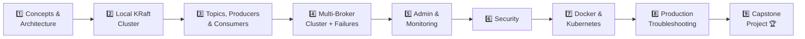

<div align="center">


# 🚀 Apache Kafka: Zero to Hero

**A practical, DevOps-focused Apache Kafka course** — from core fundamentals to production-grade operations.


</div>

---

## 📖 About

This course takes you from **Kafka fundamentals** to **production operations** — covering architecture, producers, consumers, replication, administration, security, monitoring, containerization, and real-world troubleshooting. It's built for engineers who want hands-on, DevOps-oriented Kafka skills, not just theory.

> 💡 **Tip:** Each module has its own README with detailed explanations, diagrams, and hands-on exercises — click any module below to jump in.

---

## 🗂️ Course Modules

<details open>
<summary><b>🟢 Foundations</b></summary>

| # | Module | Topics |
|:-:|--------|--------|
| 01 | [Introduction to Kafka](./01-Introduction-to-Kafka/README.md) | Kafka, use cases, messaging, event-driven architecture |
| 02 | [Kafka Architecture](./02-Kafka-Architecture/README.md) | Brokers, topics, partitions, offsets, consumers, replication |
| 03 | [Installation & Setup](./03-Installation-and-Setup/README.md) | KRaft, single broker, multi-broker cluster, CLI |
| 04 | [Topics & Partitions](./04-Topics-and-Partitions/README.md) | Topic management, partitions, keys, offsets |

</details>

<details open>
<summary><b>🔵 Core Concepts</b></summary>

| # | Module | Topics |
|:-:|--------|--------|
| 05 | [Producers](./05-Kafka-Producers/README.md) | Producer configuration, acknowledgements, retries, idempotency |
| 06 | [Consumers](./06-Kafka-Consumers/README.md) | Consumer groups, offsets, commits, rebalancing, lag |
| 07 | [Replication & HA](./07-Replication-and-High-Availability/README.md) | Leaders, followers, ISR, leader election, durability |
| 08 | [Storage & Retention](./08-Storage-and-Retention/README.md) | Logs, segments, retention, compaction, tombstones |

</details>

<details open>
<summary><b>🟣 Operations & Integration</b></summary>

| # | Module | Topics |
|:-:|--------|--------|
| 09 | [Administration](./09-Kafka-Administration/README.md) | CLI, configs, groups, reassignment, scaling |
| 10 | [Kafka Connect](./10-Kafka-Connect/README.md) | Source/sink connectors, workers, distributed mode |
| 11 | [Schema & Serialization](./11-Schema-and-Serialization/README.md) | JSON, Avro, Protobuf, Schema Registry |
| 12 | [Security](./12-Kafka-Security/README.md) | TLS, SASL, ACLs, authentication, authorization |
| 13 | [Monitoring](./13-Kafka-Monitoring/README.md) | Metrics, JMX, Prometheus, Grafana, alerting |

</details>

<details open>
<summary><b>🟠 Containers & Orchestration</b></summary>

| # | Module | Topics |
|:-:|--------|--------|
| 14 | [Docker](./14-Kafka-with-Docker/README.md) | Kafka with Docker Compose |
| 15 | [Kubernetes](./15-Kafka-with-Kubernetes/README.md) | Strimzi, stateful workloads, persistence, networking |

</details>

<details open>
<summary><b>🔴 Advanced & Production</b></summary>

| # | Module | Topics |
|:-:|--------|--------|
| 16 | [Error Handling](./16-Error-Handling-and-DLT/README.md) | Retry topics, DLT, poison messages, idempotency |
| 17 | [Advanced Kafka](./17-Advanced-Kafka/README.md) | Delivery semantics, transactions, Streams, CQRS |
| 18 | [Troubleshooting](./18-Kafka-Troubleshooting/README.md) | Production failures and diagnostic workflows |
| 19 | [Production](./19-Production-Kafka/README.md) | Sizing, capacity, HA, DR, performance, best practices |

</details>

<details open>
<summary><b>🏆 Capstone</b></summary>

| # | Module | Topics |
|:-:|--------|--------|
| 20 | [Real-World Project](./20-Real-World-Project/README.md) | Event-driven e-commerce platform |

</details>

---

## 🗺️ Suggested Learning Path



1. Learn Kafka concepts and architecture
2. Build a local KRaft cluster
3. Work with topics, partitions, producers, and consumers
4. Build a multi-broker cluster and test failures
5. Learn administration and monitoring
6. Secure Kafka
7. Run Kafka with Docker and Kubernetes
8. Practice production troubleshooting
9. Complete the capstone project

---

## ✅ Prerequisites

| Skill | Needed For |
|-------|------------|
| 🐧 Basic Linux | CLI, file systems, process management |
| 🌐 Basic networking | Brokers, ports, connectivity, TLS |
| 🔧 Git | Cloning and navigating the repo |
| 🐳 Docker fundamentals | Modules 14+ |
| ☸️ Kubernetes fundamentals | Module 15 |
| 💻 Basic programming knowledge | Producer/consumer examples |
| 📊 Basic Prometheus/Grafana knowledge | Module 13 |

---

## 📁 Repository Structure

```text
Apache-Kafka-Zero-to-Hero/
├── README.md
├── LICENSE
├── docs/
├── 01-Introduction-to-Kafka/
├── 02-Kafka-Architecture/
├── 03-Installation-and-Setup/
├── 04-Topics-and-Partitions/
├── 05-Kafka-Producers/
├── 06-Kafka-Consumers/
├── 07-Replication-and-High-Availability/
├── 08-Storage-and-Retention/
├── 09-Kafka-Administration/
├── 10-Kafka-Connect/
├── 11-Schema-and-Serialization/
├── 12-Kafka-Security/
├── 13-Kafka-Monitoring/
├── 14-Kafka-with-Docker/
├── 15-Kafka-with-Kubernetes/
├── 16-Error-Handling-and-DLT/
├── 17-Advanced-Kafka/
├── 18-Kafka-Troubleshooting/
├── 19-Production-Kafka/
└── 20-Real-World-Project/
```

---

## 🎯 Goal

By the end of this repository, students should be able to **deploy, configure, use, monitor, secure, troubleshoot, and operate Apache Kafka** in a production-oriented DevOps environment.

---

<div align="center">

**⭐ Found this useful? Star the repo and start with [Module 01](./01-Introduction-to-Kafka/README.md) →**

</div>
